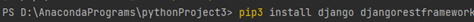
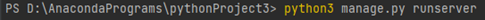
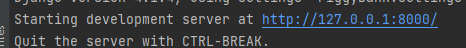

# PiggyBank

PiggyBank

Overview:

The RESTful API that I developed is created using the Python framework Django. This simple CRUD functionality enables the creation of records for Accounts and allows transactions for Deposits and Withdrawals.

General Instructions:

To run the CRUD operations in the RESTful API, the following are required:

•	Install an IDE with Python (Preferably PyCharm).
•	Open the terminal and install the following packages: “pip3 install django djangorestframework”.

•	Type: “python3 manage.py runserver”

 
•	Proceed with your browser and search the development server found in the terminal (http://127.0.0.1:8000/). (For shortcut key, Alt + Click)

You noticed that the server prompt shows "Page not found" because APIs not declared, so you need to add the following API paths to the end of the URL:
 
	api/account
	api/withdraw
	api/deposit

• You need to create records first in the api/account so that you can create records for api/withdraw and api/deposit. 
